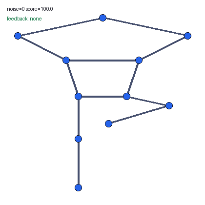

# Virtual Yoga Instructor Feedback Engine

Paper-faithful Python companion for *Virtual Yoga Instructor with Real-Time
Feedback* (CISS 2025).



## Best Evidence

- **What I built:** a MediaPipe-compatible pose feedback engine with eight
  angle checks, correction prompts, markers, and TCP/JSON packet encoding.
- **What is reproduced:** deterministic landmark geometry, scoring,
  directional prompts, robustness curves, and synthetic visual overlays.
- **What is unavailable:** camera capture, MediaPipe runtime inference,
  Unity/Mixamo/Blender assets, and raw participant records.
- **Main verified result:** geometry-only scoring averaged `0.0171 ms` locally;
  end-to-end camera-to-Unity latency is explicitly `NOT_RUN`.
- **How to verify:** `uv sync --frozen && make test && make reproduce-smoke`.

It implements the MediaPipe 33-landmark schema, eight reference-pose joint
angles, tolerance scoring, 16 directional correction prompts, marker
coordinates, and acknowledged TCP/JSON messages for the Unity boundary.
Unity/Mixamo/Blender assets and participant records are not redistributed.

Full runs generate `feedback_demo.gif` and `pose_feedback_overlay.png` under
`reports/latest/` so the geometry feedback behavior can be inspected visually.
These are synthetic landmark renders, not camera or Unity recordings.
See the static overlay at
[`reports/latest/pose_feedback_overlay.png`](reports/latest/pose_feedback_overlay.png).

```bash
uv sync
make test
make reproduce-smoke
make reproduce-results
```
